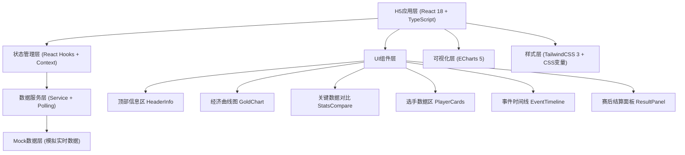

## 1. 架构设计



---

## 2. 技术选型说明

| 分类 | 技术 | 版本 | 选型理由 |
|------|------|------|---------|
| 前端框架 | React | 18.x | 组件化开发、Hooks高效状态管理、生态成熟 |
| 类型系统 | TypeScript | 5.x | 类型安全、提升代码质量、减少运行时错误 |
| 构建工具 | Vite | 5.x | 极速HMR、原生ESM、构建速度快 |
| 样式方案 | TailwindCSS | 3.x | 原子化CSS、响应式快速开发、暗色主题支持 |
| 图表库 | ECharts | 5.x | 功能强大、移动端性能好、支持缩放平移 |
| 动效方案 | Framer Motion | 11.x | 声明式动画、手势支持、性能优秀 |
| 数据模拟 | MSW / 纯Mock | - | 模拟WebSocket推送和轮询数据 |
| 状态管理 | React Context + useReducer | - | 轻量级、避免过度工程化 |

---

## 3. 目录结构

```
src/
├── components/
│   ├── HeaderInfo/           # 顶部信息区（比分、赛制、计时）
│   ├── GoldChart/            # 经济曲线对比图
│   ├── StatsCompare/         # 关键数据对比
│   ├── PlayerCards/          # 选手数据区
│   ├── EventTimeline/        # 事件时间线
│   ├── ResultPanel/          # 赛后结算面板
│   └── shared/               # 共享组件（卡片、标签等）
├── types/
│   └── match.ts              # 所有数据类型定义
├── hooks/
│   ├── useMatchData.ts       # 比赛数据Hook（核心轮询逻辑）
│   ├── useAnimatedNumber.ts  # 数字滚动动画Hook
│   └── useReplayMode.ts      # 事件回放模式Hook
├── services/
│   └── matchService.ts       # 数据服务（接口抽象+Mock）
├── data/
│   └── mockData.ts           # Mock初始数据
├── utils/
│   ├── formatters.ts         # 格式化工具（时间、金钱等）
│   └── echartsTheme.ts       # ECharts主题配置
├── styles/
│   └── globals.css           # 全局样式、CSS变量、Tailwind
├── context/
│   └── MatchContext.tsx      # 比赛全局状态Context
├── App.tsx                   # 根组件
└── main.tsx                  # 入口文件
```

---

## 4. 路由定义

本项目为单页应用，根据比赛状态切换视图，无多路由。

| 状态 | 视图 | 触发条件 |
|------|------|---------|
| `live` | 实时数据面板 | 比赛状态为进行中 |
| `paused` | 实时面板 + 暂停遮罩 | 比赛暂停 |
| `finished` | 赛后结算面板 | 比赛结束 |

---

## 5. 数据类型定义 (TypeScript)

```typescript
// 比赛状态
export type MatchStatus = 'live' | 'paused' | 'finished';

// 队伍信息
export interface Team {
  id: string;
  name: string;
  logo: string;
  color: string;
  score: number;
  totalGold: number;
  kills: number;
  deaths: number;
  assists: number;
  towers: number;
  dragons: number;
  barons: number;
  heralds: number;
}

// 选手信息
export interface Player {
  id: string;
  teamId: string;
  name: string;
  avatar: string;
  champion: string;
  championIcon: string;
  kills: number;
  deaths: number;
  assists: number;
  cs: number;
  gold: number;
  goldDiff: number;
  items: Item[];
  role: 'top' | 'jungle' | 'mid' | 'adc' | 'support';
  level: number;
}

// 装备
export interface Item {
  id: string;
  name: string;
  icon: string;
}

// 经济数据点
export interface GoldPoint {
  time: number;
  blueGold: number;
  redGold: number;
  diff: number;
}

// 事件类型
export type EventType = 
  | 'first_blood' 
  | 'kill' 
  | 'tower' 
  | 'dragon' 
  | 'baron' 
  | 'herald' 
  | 'teamfight'
  | 'inhibitor'
  | 'surrender';

// 比赛事件
export interface MatchEvent {
  id: string;
  type: EventType;
  time: number;
  timestamp: number;
  title: string;
  description: string;
  teamId?: string;
  playerId?: string;
  replayData: {
    blueGold: number;
    redGold: number;
    blueStats: Partial<Team>;
    redStats: Partial<Team>;
  };
}

// MVP数据
export interface MVPData {
  player: Player;
  rating: number;
  criteria: {
    kdaContribution: number;
    damageContribution: number;
    objectiveParticipation: number;
    goldEfficiency: number;
    teamfightImpact: number;
  };
}

// 高光时刻
export interface Highlight {
  id: string;
  event: MatchEvent;
  thumbnail: string;
  duration: number;
}

// 比赛全量数据
export interface MatchData {
  matchId: string;
  format: string;
  currentGame: number;
  totalGames: number;
  gameTime: number;
  status: MatchStatus;
  blueTeam: Team;
  redTeam: Team;
  players: Player[];
  goldHistory: GoldPoint[];
  events: MatchEvent[];
  mvp?: MVPData;
  highlights?: Highlight[];
  winner?: 'blue' | 'red';
}
```

---

## 6. API 接口设计

采用Service层抽象，可灵活切换 Mock 数据或真实接口。

### 6.1 数据服务接口

```typescript
// matchService.ts
export interface MatchService {
  // 获取初始比赛数据
  getInitialMatch(): Promise<MatchData>;
  
  // 获取增量更新（轮询调用）
  getMatchUpdate(matchId: string, sinceTime: number): Promise<Partial<MatchData>>;
  
  // 订阅实时推送（WebSocket模式）
  subscribeToUpdates(matchId: string, callback: (data: Partial<MatchData>) => void): () => void;
}
```

### 6.2 数据更新事件类型

| 事件类型 | 说明 | 触发频率 |
|---------|------|---------|
| `TIME_TICK` | 游戏时间+1秒 | 每秒 |
| `GOLD_UPDATE` | 经济曲线新增数据点 | 每5秒 |
| `PLAYER_STATS` | 选手KDA/补刀/装备更新 | 每3秒 |
| `TEAM_STATS` | 团队资源统计更新 | 事件触发时 |
| `NEW_EVENT` | 新事件产生 | 事件触发时 |
| `STATUS_CHANGE` | 比赛状态变更（暂停/结束等） | 状态变化时 |
| `GAME_END` | 本局结束 | 胜负产生时 |

---

## 7. 性能优化策略

### 7.1 数据更新优化
- **增量更新**：只传输变化字段，而非全量数据
- **数据缓存**：使用 `useMemo` 缓存派生数据，避免重复计算
- **防抖节流**：高频事件（如图表缩放）使用 `useDebounce`
- **requestAnimationFrame**：计时器与浏览器重绘同步，避免闪烁

### 7.2 渲染优化
- **React.memo**：纯展示组件用 memo 包裹，避免不必要重渲染
- **虚拟列表**：事件时间线数据量大时采用虚拟滚动
- **图片懒加载**：选手头像、装备图标使用 lazy loading
- **CSS transform**：动画优先使用 transform/opacity，触发 GPU 加速

### 7.3 ECharts 性能
- **采样降频**：移动端经济曲线数据点过多时开启 downsampling
- **按需引入**：只引入用到的 ECharts 模块（Line、Tooltip、DataZoom）
- **setOption 合并模式**：使用 `setOption(option, { notMerge: false })` 增量更新
- **resize 防抖**：窗口 resize 事件防抖处理

---

## 8. 兼容性保障

| 浏览器 | 版本要求 | 验证点 |
|--------|---------|--------|
| Chrome Mobile | ≥80 | 核心功能+动效 |
| Safari iOS | ≥13 | ECharts渲染+触摸手势 |
| Firefox Mobile | ≥80 | 布局+样式 |
| WebView (微信/QQ) | - | 兼容性降级方案 |

**Polyfill策略**：
- 核心：`core-js/stable`, `regenerator-runtime`
- 可选：`ResizeObserver` polyfill，IntersectionObserver polyfill

---

## 9. 数据缓存机制

```typescript
// 本地缓存键
const CACHE_KEYS = {
  MATCH_DATA: 'es_match_data',
  EVENT_SNAPSHOTS: 'es_event_snapshots',
  LAST_UPDATE: 'es_last_update',
} as const;

// 缓存策略
// 1. 页面加载：localStorage读取缓存 + 请求最新数据
// 2. 实时更新：内存状态优先，节流写入localStorage（每10秒）
// 3. 离线场景：网络断开时展示缓存数据，显示"连接中断"提示
// 4. 事件快照：每个事件产生时缓存该时刻全量数据快照，用于回放
```
