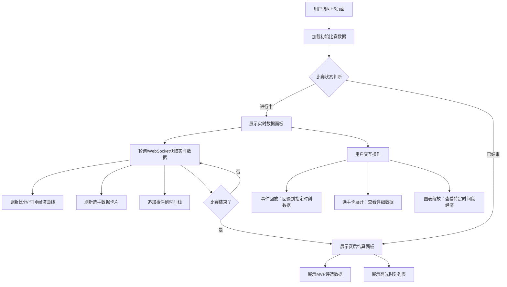

## 1. 产品概述

专业级电竞赛事实时数据展示H5面板，为电竞观众、分析师提供沉浸式比赛数据体验。通过实时比分、经济曲线、选手数据、事件时间线等多维度数据可视化，让用户深度参与每一场电竞对决。

- 主要目标：打造电竞行业标杆级数据展示平台，覆盖比赛全程（赛前/赛中/赛后）
- 目标用户：电竞观众、赛事解说、数据分析爱好者、战队教练

---

## 2. 核心功能

### 2.1 用户角色

| 角色 | 注册方式 | 核心权限 |
|------|---------|---------|
| 普通观众 | 无需注册 | 浏览实时数据、查看事件回放、查看赛后结算 |
| 赛事管理员 | 后台登录 | 数据录入、比赛状态控制 |

### 2.2 功能模块

1. **比赛进行中实时面板**：顶部信息区、经济曲线图、关键数据对比、选手数据卡、事件时间线
2. **赛后结算面板**：MVP评选、高光时刻回放、全方面数据统计
3. **交互动效系统**：卡片展开、事件回放、图表缩放、暂停/继续适配

### 2.3 页面详情

| 页面名称 | 模块名称 | 功能描述 |
|---------|---------|---------|
| 比赛实时面板 | 顶部信息区 | 比分展示、赛制信息、游戏计时器（精确到秒）、暂停状态指示 |
| 比赛实时面板 | 经济曲线对比图 | ECharts动态滚动折线图，时间轴缩放，双队经济对比 |
| 比赛实时面板 | 关键数据对比 | KDA比率、防御塔数、小龙/大龙/男爵资源控制数 |
| 比赛实时面板 | 选手数据区 | 5v5选手卡片，头像/英雄/装备/KDA/补刀/经济，经济领先方绿色高亮，点击展开详情 |
| 比赛实时面板 | 比赛事件流 | 横向滚动时间线，关键事件标记，点击回放该时刻经济差和数据 |
| 赛后结算面板 | MVP评选展示 | MVP选手详细数据、评分依据、多维度对比 |
| 赛后结算面板 | 高光时刻回放 | 本局关键事件列表，支持点击查看事件详情 |

---

## 3. 核心流程

用户进入页面 → 系统加载初始比赛数据 → 实时数据推送更新面板 → 经济曲线/选手数据/事件流动态刷新 → 用户交互（点击事件回放/展开选手卡/缩放图表） → 比赛结束自动切换至结算面板 → 展示MVP和高光时刻

---

## 4. 用户界面设计

### 4.1 设计风格

- **主色调**：深空黑 `#0A0E1A` 为基底，搭配电竞蓝 `#00D4FF`、能量红 `#FF3366`、生命绿 `#00FFA3`、金色 `#FFD700`
- **辅助色**：渐变辉光、霓虹光效、赛博朋克发光边框
- **按钮风格**：圆角8px，hover发光效果，渐变填充
- **字体**：展示字体使用 Orbitron（电竞数字感），正文字体使用 Rajdhani（锐利科技感）
- **布局风格**：卡片悬浮式布局，毛玻璃模糊效果，动态辉光边框，层次感强烈
- **图标风格**：线性图标+发光效果，关键数据带脉冲动画

### 4.2 页面设计概览

| 页面名称 | 模块名称 | UI元素 |
|---------|---------|--------|
| 实时面板 | 顶部信息区 | 双队LOGO并排，中间大号比分，赛制标签，动态计时器，暂停遮罩 |
| 实时面板 | 经济曲线图 | 双折线（蓝队蓝/红队红），渐变填充区域，滚动时间轴，缩放滑块 |
| 实时面板 | 关键数据对比 | 三列数据块（KDA/塔/资源），中间对战VS分割，进度条对比 |
| 实时面板 | 选手数据区 | 上下两排各5张卡片，经济领先方绿色边框脉冲，装备图标横向排列 |
| 实时面板 | 事件时间线 | 横向滚动条，事件节点图标，事件文字标签，选中高亮放大 |
| 结算面板 | MVP展示 | MVP选手大卡片，数据雷达图，评分标签，发光边框 |
| 结算面板 | 高光列表 | 时间轴式列表，事件类型图标，缩略图占位，点击展开 |

### 4.3 响应式设计

- **移动优先**：以375px宽度为基准设计，自适应至768px平板、1024px+桌面
- **触控优化**：所有交互元素最小44x44px触控区域，支持横向滑动手势
- **图表响应式**：ECharts自动重绘，移动端简化数据密度，保留关键信息
- **断点策略**：375px（手机）、768px（平板）、1024px（桌面）三级断点

### 4.4 动效设计指引

- **入场动画**：组件渐入+上滑，stagger延迟依次出现，总时长500ms
- **数据更新**：数字滚动动画（odometer效果），颜色闪烁提示变化
- **事件脉冲**：新事件出现时脉冲光晕+左右轻微抖动
- **经济领先切换**：颜色渐变过渡，边框发光强度变化
- **暂停状态**：全局半透明遮罩+呼吸灯"暂停中"文字
- **选手卡展开**：高度平滑过渡，子元素渐入
